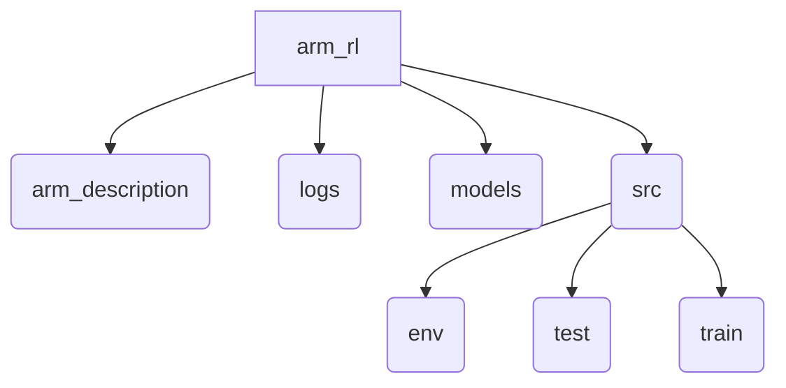

# 机械臂强化学习代码笔记

## 仓库结构



## 学习进度

- [x] 环境搭建

```cmd
pip install -r requirements.txt
```

- [x] 环境测试

```cmd
# cuda\cudnn环境
python env_test/cuda_cudnn_test.py
# gynasium环境
python env_test/gymnasium_demo_test.py
# mujoco环境
python env_test/mujoco_demo_test.py
# pybullet环境
python env_test/pybullet_demo_test.py
```

- [ ] 机械臂强化学习抓取